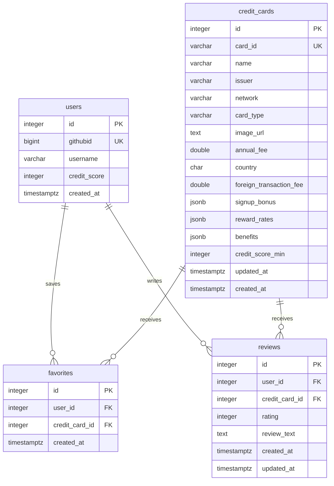

# CardMaxer Entity Relationship Diagram

The final CardMaxer database contains four tables. Credit card details are stored in PostgreSQL and loaded from the maintained catalog in `src/server/data/cardData.js`; the application does not call an external card API at runtime.

Each user can favorite a card once and review a card once. Deleting a user or card cascades to its related favorites and reviews.
